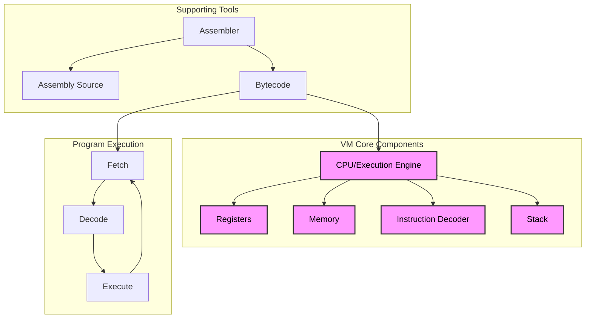
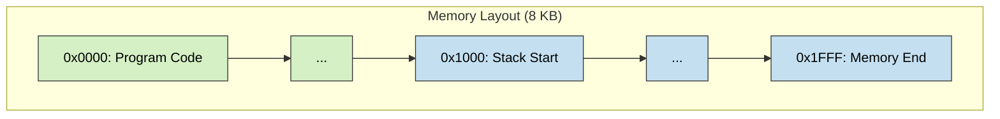
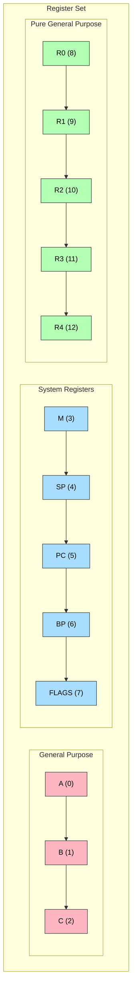
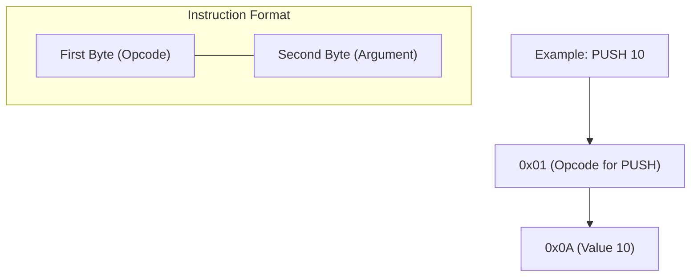
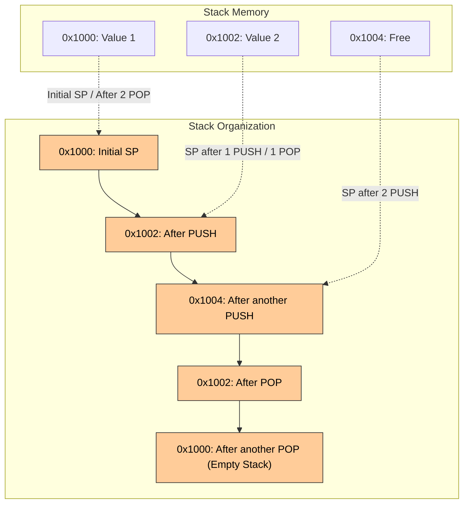
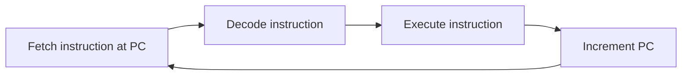
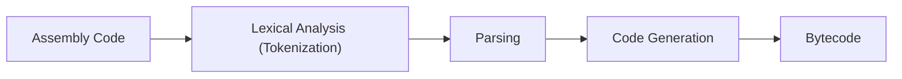
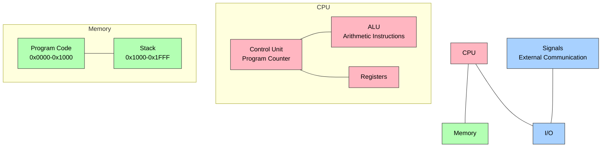
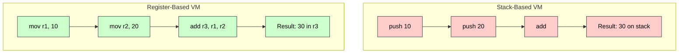

## Introduction

Have you ever wondered what happens under the hood when you run a computer program? How does a CPU interpret instructions? How does memory work? In this post, I'll take you through building a virtual machine (VM) from scratch using Rust. By implementing our own simplified computer architecture, we'll gain insights into how real computers function at a fundamental level.

The Rusty 16-bit VM project demonstrates a stack-based virtual machine with a small instruction set, capable of running simple programs. Whether you're a seasoned developer wanting to understand low-level computing or a beginner curious about how computers work, this project offers valuable insights into:

* Machine code execution
    
* Memory management
    
* CPU registers
    
* Stack-based operations
    
* Instruction encoding/decoding
    
* Assembly language fundamentals
    

Let's dive into the architecture and implementation of our virtual machine!

> 🔗 **Note: You can always refer to this repository for the whole codebase**
> 
> Repository - [https://github.com/dtg-lucifer/16bit-vm-rust](https://github.com/dtg-lucifer/16bit-vm-rust)

## What is a Virtual Machine?

A virtual machine is a software emulation of a physical computer. It simulates hardware components like a CPU, memory, and I/O devices. VMs are used for various purposes:

1. Running multiple operating systems on one physical machine
    
2. Testing software in isolated environments
    
3. Running legacy code on new hardware
    
4. Learning about computer architecture (our purpose!)
    

The VM we're building is simple but illustrates the core concepts that power all computing devices, from your smartphone to supercomputers.

## Architecture Overview

Our Rusty 16-bit VM is a stack-based virtual machine with the following components:

1. **Memory**: 8 KB (8192 bytes) of linear memory
    
2. **Registers**: 13 16-bit registers for various purposes
    
3. **Stack**: For temporary data storage and operations
    
4. **Instruction Set**: A small set of operations like PUSH, POP, ADD
    
5. **Assembler**: Translates human-readable assembly code to bytecode
    

Let's visualize the overall architecture:



## Memory System

Our VM has 8 KB of memory organized as a simple linear array of bytes. Memory addresses range from `0x0000` to `0x1FFF`. The memory is divided into program space (starting at address 0) and stack space (starting at address 0x1000).



Here's the implementation of our memory system:

```rust
/// A flat, linear memory implementation for the VM.
/// Provides contiguous memory with bounds-checking on all operations.
pub struct LinearMemory {
    /// The actual memory storage as a vector of bytes
    bytes: Vec<u8>,
    /// Total size of the memory in bytes
    size: usize,
}

impl LinearMemory {
    /// Creates a new linear memory instance with the specified size.
    /// All memory locations are initialized to zero.
    pub fn new(n: usize) -> Self {
        Self {
            bytes: vec![0; n],
            size: n,
        }
    }
}

impl Addressable for LinearMemory {
    /// Reads a single byte from memory.
    /// Performs bounds checking to ensure the address is valid.
    fn read(&self, addr: u16) -> Option<u8> {
        if (addr as usize) < self.size {
            Some(self.bytes[addr as usize])
        } else {
            None
        }
    }

    /// Writes a single byte to memory.
    /// Performs bounds checking to ensure the address is valid.
    fn write(&mut self, addr: u16, value: u8) -> bool {
        if (addr as usize) < self.size {
            self.bytes[addr as usize] = value;
            true
        } else {
            false
        }
    }
}
```

Our memory implementation supports both 8-bit and 16-bit operations. For 16-bit operations (reading/writing 2 bytes at once), we use little-endian byte order, which means the least significant byte is stored at the lower address:

```rust
/// Reads a 16-bit word from memory using little-endian format.
/// Lower byte at addr, upper byte at addr+1
fn read2(&self, addr: u16) -> Option<u16> {
    if let Some(lo) = self.read(addr) {
        if let Some(hi) = self.read(addr + 1) {
            // Combine bytes in little-endian format:
            // Lower byte from addr, upper byte from addr+1
            return Some((lo as u16) | ((hi as u16) << 8));
        }
    }
    None
}

/// Writes a 16-bit word to memory using little-endian format.
/// Lower byte at addr, upper byte at addr+1
fn write2(&mut self, addr: u16, value: u16) -> bool {
    // Extract lower and upper bytes from the 16-bit value
    let lo = (value & 0xff) as u8; // Lower 8 bits
    let hi = ((value >> 8) & 0xff) as u8; // Upper 8 bits

    // Write bytes in little-endian format:
    // Lower byte at addr, upper byte at addr+1
    self.write(addr, lo) && self.write(addr + 1, hi)
}
```

## Register System

Registers are small, fast storage locations within a CPU. Our VM has 13 16-bit registers divided into three categories:

1. **General Purpose (A, B, C)**: For arithmetic and data manipulation
    
2. **System Registers (M, SP, PC, BP, FLAGS)**: For controlling VM execution
    
3. **Pure General Purpose (R0-R4)**: Additional data storage
    



Here's how we define our registers using a macro:

```rust
use crate::define_registers;

define_registers! {
    /// Register enum definition with 8 registers.
    #[derive(Debug, PartialEq, Eq, Clone, Copy)]
    #[repr(u8)]
    pub enum Register {
        /// General purpose register A (index 0)
        A = 0x00,
        /// General purpose register B (index 1)
        B = 0x01,
        /// General purpose register C (index 2)
        C = 0x02,
        /// Memory operations register (index 3)
        M = 0x03,
        /// Stack Pointer register - points to next available stack location (index 4)
        SP = 0x04,
        /// Program Counter register - points to next instruction (index 5)
        PC = 0x05,
        /// Base Pointer register - for stack frames (index 6)
        BP = 0x06,
        /// Status flags register (index 7)
        FLAGS = 0x07,
        /// Extended register R0 (index 8)
        R0 = 0x08,
        /// Extended register R1 (index 9)
        R1 = 0x09,
        /// Extended register R2 (index 10)
        R2 = 0x0A,
        /// Extended register R3 (index 11)
        R3 = 0x0B,
        /// Extended register R4 (index 12)
        R4 = 0x0C,
    }
}
```

Let me explain the purpose of some key registers:

* **PC (Program Counter)**: Points to the next instruction to execute
    
* **SP (Stack Pointer)**: Points to the top of the stack
    
* **BP (Base Pointer)**: Used for stack frames (function calls)
    
* **FLAGS**: Stores status flags for conditional operations
    
* **A, B, C**: General purpose registers for arithmetic and data
    

## Instruction Set

The VM's instruction set is the collection of operations it can perform. Each instruction is encoded as a 2-byte value:



Our VM supports these core instructions:

| Opcode | Mnemonic | Assembly | Description |
| --- | --- | --- | --- |
| 0x00 | NOP | `NOP` | No operation |
| 0x01 | PUSH | `PUSH %n/$n` | Push value onto stack |
| 0x02 | POPREGISTER | `POP reg` | Pop value from stack into register |
| 0x03 | PUSHREGISTER | `PUSHR reg` | Push register value onto stack |
| 0x0F | ADDSTACK | `ADDS` | Pop two values, add them, push result |
| 0x04 | ADDREGISTER | `ADDR r1 r2` | Add two registers, store in first register |
| 0x09 | SIGNAL | `SIG $n` | Signal the VM with a specific code |

Here's the implementation of our operation parsing:

```rust
/// Parses a 16-bit instruction into an operation.
/// Extracts the opcode (lower 8 bits) and returns the corresponding operation.
pub fn parse_instructions(ins: u16) -> Result<Op, String> {
    let op = (ins & 0xff) as u8;

    match op {
        x if x == Op::Nop.value() => Ok(Op::Nop),
        x if x == Op::Push(0).value() => Ok(Op::Push(parse_instructions_arg(ins))),
        x if x == Op::PopRegister(Register::A).value() => {
            let arg = parse_instructions_arg(ins);
            Register::from_u8(arg)
                .ok_or(format!("unknown register - 0x{:X}", arg))
                .map(|r| Op::PopRegister(r))
        }
        x if x == Op::PushRegister(Register::A).value() => {
            let arg = parse_instructions_arg(ins);
            Register::from_u8(arg)
                .ok_or(format!("unknown register - 0x{:X}", arg))
                .map(|r| Op::PushRegister(r))
        }
        x if x == Op::AddRegister(Register::A, Register::A).value() => {
            let arg = parse_instructions_arg(ins);
            // The first byte is the opcode
            // The second byte is divided into two 4 bit parts to store 2 register address
            let reg1 = (arg >> 4) & 0x0F; // Upper 4 bits
            let reg2 = arg & 0x0F; // Lower 4 bits
            let r1 = Register::from_u8(reg1).ok_or(format!("unknown register - 0x{:X}", reg1))?;
            let r2 = Register::from_u8(reg2).ok_or(format!("unknown register - 0x{:X}", reg2))?;
            Ok(Op::AddRegister(r1, r2))
        }
        x if x == Op::AddStack.value() => Ok(Op::AddStack),
        x if x == Op::Signal(0).value() => Ok(Op::Signal(parse_instructions_arg(ins))),
        _ => Err(format!("unknown op - 0x{:X}", op)),
    }
}
```

And here's how we execute instructions:

```rust
/// Executes a single instruction in the VM.
pub fn execute_instruction(machine: &mut Machine, op: Op) -> Result<(), String> {
    // Execute the operation
    match op {
        Op::Nop => Ok(()),
        Op::Push(v) => machine.push(v.into()),
        Op::PopRegister(r) => {
            let value = machine.pop()?;
            machine.registers[r as usize] = value;
            Ok(())
        }
        Op::PushRegister(r) => {
            let value = machine.registers[r as usize];
            machine.push(value)?;
            Ok(())
        }
        Op::AddStack => {
            let a = machine.pop()?;
            let b = machine.pop()?;
            let result = a + b;
            machine.push(result)?;
            Ok(())
        }
        Op::AddRegister(r1, r2) => {
            machine.registers[r1 as usize] += machine.registers[r2 as usize];
            Ok(())
        }
        Op::Signal(s) => {
            let sig_fn = machine
                .signal_handlers
                .get(&s)
                .ok_or(format!("unknown signal - 0x{:X}", s))?;
            sig_fn(machine)
        }
    }
}
```

## The Stack

Our VM uses a stack for temporary data storage and operations. The stack grows upward from address 0x1000:



Here's the implementation of our stack operations:

```rust
/// Pops a 16-bit value from the stack.
/// First decrement SP by 2, then read the value at the new SP location.
/// Restores SP on error.
pub fn pop(&mut self) -> Result<u16, String> {
    // For pop, first decrement SP, then read
    self.registers[Register::SP as usize] -= 2;
    let sp = self.registers[Register::SP as usize];
    if let Some(v) = self.memory.read2(sp) {
        Ok(v)
    } else {
        // Restore SP on error
        self.registers[Register::SP as usize] += 2;
        return Err(format!("memory read fault - 0x{:X}", sp));
    }
}

/// Pushes a 16-bit value onto the stack.
/// First write at current SP, then increment SP by 2
pub fn push(&mut self, v: u16) -> Result<(), String> {
    // For push, first write at current SP, then increment
    let sp = self.registers[Register::SP as usize];
    if !self.memory.write2(sp, v) {
        return Err(format!("memory write fault - 0x{:X}", sp));
    }
    self.registers[Register::SP as usize] += 2;
    Ok(())
}
```

## Execution Cycle

The VM operates on a simple fetch-decode-execute cycle:



Here's the core execution loop:

```rust
/// Executes a single instruction in the VM.
///
/// 1. Reads instruction from memory at PC
/// 2. Increments PC by 2 (each instruction is 2 bytes)
/// 3. Parses and executes the operation
pub fn step(&mut self) -> Result<(), String> {
    let pc = self.registers[Register::PC as usize];

    // Read opcode and argument as separate bytes for debugging output
    let opcode = self.memory.read(pc).unwrap_or(0);
    let arg = self.memory.read(pc + 1).unwrap_or(0);

    // Read the full 16-bit instruction (in little-endian format)
    // This gives us a value where:
    // - Lower 8 bits contain the opcode (memory[pc])
    // - Upper 8 bits contain the argument (memory[pc+1])

    let ins = self
        .memory
        .read2(pc)
        .ok_or(format!("memory read fault at PC=0x{:04X}", pc))?;

    // Increment the Program Counter register by 2 to move to the next instruction
    // (each instruction is 2 bytes: 1 for opcode, 1 for argument)
    self.registers[Register::PC as usize] = pc + 2;

    let op = parse_instructions(ins)?;

    // Debug output - consider making this optional or moving to a debug method
    println!(
        "Instruction: opcode=0x{:02X}, arg=0x{:02X} @ PC={} => {op:?}, SP=0x{:04X}",
        opcode,
        arg,
        pc,
        self.registers[Register::SP as usize]
    );

    execute_instruction(self, op)
}
```

## The Assembler

Writing programs directly in machine code is tedious and error-prone. To make our VM more usable, we've implemented an assembler that translates human-readable assembly code into bytecode.

The assembler pipeline works like this:



Let's look at how the tokenizer works:

```rust
#[derive(Debug, Clone, PartialEq)]
pub enum Token {
    /// e.g. PUSH, POP, etc.
    Keyword(String),
    /// e.g. A, B, C, M, R0, R1 etc.
    Register(String),
    /// e.g. %42
    Immediate(u8),
    /// e.g. $2A
    Hex(u8),
    /// e.g. label: in the form of
    /// ```asm
    /// label:
    ///     PUSH %10
    /// ```
    LabelDecl(String),
}

impl Token {
    pub fn tokenize_line(line: &str) -> Vec<Self> {
        let line = line.trim();
        if line.ends_with(":") {
            return vec![Token::LabelDecl(line.trim_end_matches(":").to_string())];
        }

        let parts: Vec<&str> = line.split_whitespace().collect();
        let mut tokens = Vec::new();

        for part in parts {
            if part.starts_with("%") {
                let val = part.trim_start_matches('%').parse::<u8>().unwrap();
                tokens.push(Token::Immediate(val));
            } else if part.starts_with("$") {
                let val = u8::from_str_radix(part.trim_start_matches('$'), 16).unwrap();
                tokens.push(Token::Hex(val));
            } else if ["A", "B", "C", "D", "R0", "R1", "R2", "R3", "R4"]
                .iter()
                .any(|&r| r.eq_ignore_ascii_case(part))
            {
                tokens.push(Token::Register(part.to_uppercase()));
            } else if part.chars().all(char::is_alphanumeric) {
                tokens.push(Token::Keyword(part.to_uppercase()));
            } else {
                panic!("Unknown token: {}", part);
            }
        }
        tokens
    }
}
```

The parser converts tokens into an intermediate representation:

```rust
#[derive(Debug, Clone)]
pub enum Instruction {
    Nop,
    PushImmediate(u8),
    PushHex(u8),
    PushRegister(String),
    Pop(String),
    AddStack,
    AddRegister(String, String),
    Signal(u8),
    Label(String),
    Jump(String),
}
```

And the code generator produces the final bytecode:

```rust
pub fn generate_bytecode(instrs: &[Instruction]) -> Result<Vec<u8>, String> {
    let mut bytecode = Vec::new();
    let mut labels = HashMap::new();

    // First pass: map labels to byte offsets
    let mut pc = 0;
    for instr in instrs {
        if let Instruction::Label(name) = instr {
            labels.insert(name.clone(), pc);
        } else {
            pc += 2;
        }
    }

    // Second pass: encode instructions
    for instr in instrs {
        match instr {
            Instruction::Nop => bytecode.extend([Op::Nop.value(), 0]),
            Instruction::PushImmediate(n) => {
                bytecode.extend([Op::Push(0).value(), *n]);
            }
            Instruction::PushHex(n) => {
                bytecode.extend([Op::Push(0).value(), *n]);
            }
            Instruction::PushRegister(r) => {
                let reg = Register::from_str(r).map_err(|_| format!("Invalid register: {}", r))?;
                bytecode.extend([Op::PushRegister(Register::A).value(), reg as u8]);
            }
            Instruction::Pop(r) => {
                let reg = Register::from_str(r).map_err(|_| format!("Invalid register: {}", r))?;
                bytecode.extend([Op::PopRegister(Register::A).value(), reg as u8]);
            }
            Instruction::AddStack => {
                bytecode.extend([Op::AddStack.value(), 0]);
            }
            Instruction::AddRegister(r1, r2) => {
                let reg1 =
                    Register::from_str(r1).map_err(|_| format!("Invalid register: {}", r1))?;
                let reg2 =
                    Register::from_str(r2).map_err(|_| format!("Invalid register: {}", r2))?;
                let m_r = (reg1 as u8) << 4 | (reg2 as u8);
                bytecode.extend([Op::AddRegister(Register::A, Register::B).value(), m_r]);
            }
            Instruction::Signal(n) => {
                bytecode.extend([Op::Signal(0).value(), *n]);
            }
            Instruction::Jump(label) => {
                // let offset = labels
                //     .get(label)
                //     .ok_or_else(|| format!("Undefined label: {}", label))?;
                // bytecode.extend([Op::Jump.value(), *offset as u8]);
                todo!("unimplemented - {label}")
            }
            Instruction::Label(_) => {} // Skip label in final bytecode
        }
    }

    Ok(bytecode)
}
```

## Writing Assembly Programs

Let's examine an example assembly program to better understand our VM's programming model:

```plaintext
; Demo program to test the ADDR instruction

add_stack:
    push %10            ; push 10 onto the stack
    push %24            ; push 24 onto the stack
    adds                ; add the top two values on the stack

pop B                   ; pop the result into B

another_add:
    push %5             ; push 5 onto the stack
    push %22            ; push 22 onto the stack
    adds                ; add the top two values on the stack

pop C                   ; pop the result into C

push %100               ; push 100 onto the stack

popping:
    pop A               ; pop the value into A
    pop B               ; pop the value into B

push %10                ; push 10 onto the stack
pop a                   ; pop the value into A
push %20                ; push 20 onto the stack
pop B                   ; pop the value into B

nop_test:
    nop                 ; do nothing
    nop                 ; do nothing
    nop                 ; do nothing

addr A B                ; add the values in A and B, result in A

pushr A                 ; push the result in A onto the stack
pop B                   ; pop the result into B

test_newer_registers:
    push %10            ; push 10 onto the stack
    push %20            ; push 20 onto the stack
    adds                ; add the top two values on the stack
    pop R0              ; pop the result into R0
    pushr R0            ; push the result in R0 onto the stack
    pop R4              ; pop the result into R4

; Now both A and B should contain the sum of their original values

sig $09             ; signal to the monitor that the program is done
```

Let's break down what this program does:

1. Adds 10 and 24 on the stack, stores the result (34) in register B
    
2. Adds 5 and 22 on the stack, stores the result (27) in register C
    
3. Stores the value 100 in register A
    
4. Resets register A to 10 and B to 20
    
5. Performs a direct register addition: A = A + B (10 + 20 = 30)
    
6. Moves the result from A to B using the stack
    
7. Adds 10 and 20 using the stack, stores the result in R0, then moves it to R4
    
8. Signals the VM to halt execution
    

## Machine Execution

Now let's look at how our VM executes a program:

```rust
fn main() -> Result<(), String> {
    let mut vm = Machine::new();
    // Register the halt signal handler for signal code 0x09
    vm.define_handler(0x09, signal_halt);

    let mut manual_mode = false;

    // ----------------------------------------------------------------
    // Load program from the specified file

    let args: Vec<_> = env::args().collect();
    if args.len() < 2 {
        return Err(format!("Usage: {} <input> [options...]", args[0]));
    }

    // Check for manual mode option
    if args.len() > 2 {
        for arg in &args[2..] {
            match arg.as_str() {
                "-m" | "--manual" => {
                    manual_mode = true;
                }
                _ => {
                    return Err(format!("Unknown option: {}", arg));
                }
            }
        }
    }

    let file: File = match File::open(Path::new(&args[1])) {
        Err(e) => {
            return Err(format!("failed to open the file, err - {}", e));
        }
        Ok(f) => f,
    };

    let mut buffer: Vec<u8> = Vec::new();
    let mut reader = BufReader::new(file);

    let r = reader.read_to_end(&mut buffer);
    match r {
        Ok(_) => println!("Program: read successfully!"),
        Err(e) => panic!("Error: cannot read, err = {e}"),
    }

    // Load the program into memory at address 0
    if let Some((bytes, instructions)) = vm.memory.load_from_vec(&buffer, 0) {
        println!(
            "Program: loaded {} bytes ({} instructions)",
            bytes, instructions
        );
        println!("Program: running loaded program...");
    }

    // Execute instructions until halted or error occurs
    while !vm.halt {
        match vm.step() {
            Ok(_) => {
                // get user input, if he or she in the manual mode
                // then each iteration will wait for user input,
                // if they pass y/Y/YES/yes then it will step another step
                // if not then it will print state, then ask again, until use passes X/x/EXIT/exit
                // then it will close the program or if it hit HALT then it will close with non-zero exit code
                if manual_mode {
                    println!(
                        "Press Enter to step, enter 's' to print state, or type 'exit' to quit..."
                    );
                    let mut input = String::new();
                    std::io::stdin().read_line(&mut input).unwrap();
                    let trimmed_input = input.trim().to_lowercase();
                    if trimmed_input == "exit" {
                        println!("Exiting manual mode.");
                        break;
                    }
                    if trimmed_input == "s" {
                        vm.print_intermediate_state();
                    }
                    continue;
                }
                continue; // continue in automatic mode
            }
            Err(e) => {
                println!("Error during execution: {}", e);
                return Err(e);
            }
        }
    }

    // Print the final state
    vm.print_final_state();

    // Successful execution
    Ok(())
}
```

## Debugging Support

The VM includes a step-by-step debugging mode that lets us see exactly what's happening during program execution:

```rust
pub fn print_intermediate_state(&self) {
    let pc = self.registers[Register::PC as usize];
    let sp = self.registers[Register::SP as usize];
    let flags = self.registers[Register::FLAGS as usize];

    // Print header with PC and SP info
    println!(
        "\n[State] PC=0x{:04X} | SP=0x{:04X} | FLAGS=0b{:08b}",
        pc, sp, flags
    );

    // First row: A, B, C, M registers
    print!("Regs: ");
    for &idx in &[Register::A, Register::B, Register::C, Register::M] {
        let val = self.registers[idx as usize];
        print!("{:?}=0x{:04X}({:<3}) ", idx, val, val);
    }
    println!();

    // Second row: R0-R4 registers
    print!("     ");
    for idx in Register::R0 as usize..=Register::R4 as usize {
        let val = self.registers[idx];
        let name = Register::from_u8(idx as u8).unwrap();
        print!("{:?}=0x{:04X}({:<3}) ", name, val, val);
    }
    println!();

    // Try to display some stack items if available
    if sp >= 0x1002 {
        // At least one item on stack
        let mut stack_items = Vec::new();
        let mut addr = sp - 2;
        // Show up to 3 items from the stack
        for _ in 0..3 {
            if addr < 0x1000 {
                break;
            }
            if let Some(val) = self.memory.read2(addr) {
                stack_items.push((addr, val));
                addr -= 2;
            } else {
                break;
            }
        }

        if !stack_items.is_empty() {
            print!("Stack: ");
            for (addr, val) in stack_items {
                print!("[0x{:04X}]=0x{:04X}({}) ", addr, val, val);
            }
            println!();
        }
    }

    // Show next instruction if available
    if let Some(opcode) = self.memory.read(pc) {
        if let Some(arg) = self.memory.read(pc + 1) {
            if let Ok(next_op) =
                crate::opcodes::parse_instructions((opcode as u16) | ((arg as u16) << 8))
            {
                println!("Next: 0x{:04X} | {:?}", pc, next_op);
            }
        }
    }
}
```

## Conceptual Foundations: From Hardware to Abstraction

Now that we've explored the implementation details of our VM, let's take a step back and think about what we've learned about computer architecture.

### The Von Neumann Architecture

Most computers today follow the von Neumann architecture, which consists of:

1. **CPU (Central Processing Unit)**: Executes instructions
    
2. **Memory**: Stores both program code and data
    
3. **Input/Output**: Interfaces with the external world
    
4. **Control Unit**: Manages the fetch-decode-execute cycle
    
5. **Arithmetic Logic Unit (ALU)**: Performs calculations
    

Our VM models this architecture with:



### Data Flow in the VM

To better understand the VM, let's follow the flow of data when executing a simple addition:

1. **Fetch**: Read the instruction from memory at the address in PC
    
2. **Decode**: Determine that it's a `PUSH 10` instruction
    
3. **Execute**: Push the value 10 onto the stack
    
4. **Fetch**: Read the next instruction (after incrementing PC)
    
5. **Decode**: Determine that it's a `PUSH 20` instruction
    
6. **Execute**: Push the value 20 onto the stack
    
7. **Fetch**: Read the next instruction
    
8. **Decode**: Determine that it's an `ADDS` instruction
    
9. **Execute**: Pop 20, pop 10, add them, push 30 onto the stack
    

This mirrors how real CPUs process instructions.

## Real-World Applications

### How Our VM Relates to Real Computer Systems

While our VM is a simplified model, it demonstrates principles found in real computing systems:

1. **Stack-Based vs. Register-Based**: Many VMs, like the Java Virtual Machine (JVM), are stack-based like ours. Others, like most physical CPUs, are register-based.
    
2. **Instruction Encoding**: Real CPUs use similar techniques to encode instructions, though often with variable-length instructions and more complex addressing modes.
    
3. **Memory Management**: Our separate program and stack areas reflect real memory layouts, though modern systems add features like virtual memory and protection.
    
4. **Assembly Language**: Our assembly syntax is simplified, but shares concepts with real assembly languages like x86 or ARM.
    

### Extending the VM

To make our VM more powerful, we could add:

1. **Conditional Branching**: Instructions like JMP (jump), JEQ (jump if equal), JNE (jump if not equal)
    
2. **Memory Access Instructions**: Load and store values directly to/from memory
    
3. **Function Call Support**: Call and return instructions with stack frames
    
4. **I/O Operations**: Read input and write output to simulate interaction
    
5. **Floating-Point Support**: Add floating-point registers and operations
    

## Comparing with Other VMs

### Stack-Based vs. Register-Based VMs

Our VM is primarily stack-based (like the JVM), but also includes registers. Let's compare:



### Performance and Complexity

* **Stack-Based**: Simpler instruction encoding, but may require more instructions
    
* **Register-Based**: More efficient execution, but more complex instruction encoding
    

Our VM combines both approaches, allowing both stack operations and direct register manipulation.

## Key Takeaways

By building this VM, we've gained insights into:

1. **CPU Architecture**: How instructions are fetched, decoded, and executed
    
2. **Memory Management**: How memory is organized and accessed
    
3. **Instruction Sets**: How operations are encoded and interpreted
    
4. **Assembly Language**: How human-readable code maps to machine code
    
5. **Debugging**: How to inspect and understand program execution
    

These concepts apply to all computing systems, from embedded microcontrollers to supercomputers.

## Conclusion

Building a virtual machine from scratch provides deep insights into how computers work at a fundamental level. Our Rusty 16-bit VM demonstrates core computing concepts in a simple, understandable implementation.

The beauty of this project is that it bridges the gap between high-level programming and the hardware that ultimately executes our code. By understanding these low-level concepts, we become better programmers, even when working with high-level languages.

I encourage you to explore the full code on GitHub, experiment with writing your own assembly programs, and consider extending the VM with new features. Understanding how computers work at this level will give you a unique perspective on software development.

## Further Exploration

If you'd like to dive deeper into computer architecture and virtual machines, here are some suggestions:

1. **Add conditional branching** to our VM to enable more complex programs
    
2. **Implement a simple compiler** for a high-level language that targets our VM
    
3. **Study real CPU architectures** like ARM or x86 to see how they compare
    
4. **Explore JIT compilation** techniques to make VM execution faster
    
5. **Learn about other VMs** like the JVM, V8 (JavaScript), or WASM
    

Remember, the best way to learn is by doing. Happy coding!